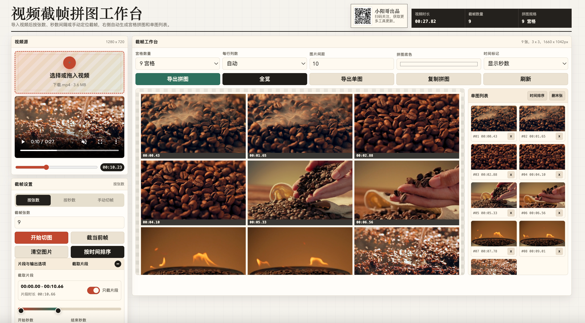
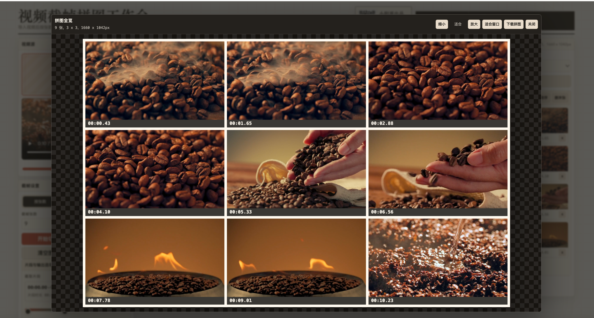

# 视频截帧拼图工作台

一个纯前端的本地视频截帧工具。直接在浏览器中导入视频，按张数、时间间隔或指定秒数截取画面，并自动生成宫格拼图与单张图片列表。

## 小阳哥出品

扫码关注，获取更多工具更新。


## 功能演示

### 截帧工作台



### 拼图全览



## 功能特性

- 本地读取视频文件，视频不会上传到服务器。
- 支持浏览器可播放的视频格式，例如 MP4、MOV、WEBM。
- 支持三种截帧方式：
  - 按目标张数平均截帧。
  - 按秒数间隔批量截帧。
  - 手动定位或输入秒数截取单帧。
- 支持选择视频片段，只对指定开始和结束时间范围截帧。
- 支持避开首尾黑场，减少无效画面。
- 支持设置单图宽度和导出格式，包含 PNG 与 JPG。
- 自动生成 4、6、9、12、16、20、25 宫格或全部图片拼图。
- 支持设置拼图列数、间距、底色和时间标记。
- 支持拖拽调整单图顺序、按时间排序、删除单张图片。
- 支持导出宫格拼图、批量导出单图、复制拼图到剪贴板。

## 快速开始

本项目没有构建步骤，也不依赖后端服务。

1. 克隆或下载仓库。
2. 用浏览器打开 `index.html`。
3. 选择或拖入本地视频。
4. 设置截帧方式、片段范围和拼图参数。
5. 点击「开始切图」，完成后导出拼图或单图。

如果浏览器对本地文件权限有限，也可以启动一个静态服务：

```bash
python3 -m http.server 8080
```

然后访问：

```text
http://localhost:8080
```

## 使用说明

### 导入视频

点击「选择或拖入视频」，选择本地视频文件。工具会在浏览器内读取视频元信息，并显示视频时长与分辨率。

### 选取片段

开启「只截片段」后，可以通过滑块、输入框，或点击「设为开始」「设为结束」来确定截帧范围。关闭后默认处理全片。

### 切图方式

- `按张数`：在片段范围内平均截取指定数量的图片。
- `按秒数`：从片段开始处按固定时间间隔截取图片。
- `手动切帧`：截取当前播放位置或输入秒数对应的单张图片。

### 拼图导出

截帧完成后，右侧会自动生成宫格拼图。可以调整宫格数量、每行列数、图片间距、背景颜色和标记方式，然后导出拼图。

## 浏览器兼容性

建议使用最新版 Chrome、Edge、Safari 或 Firefox。复制拼图功能依赖浏览器的剪贴板图片写入能力，如果当前浏览器不支持，按钮会自动不可用。

## 隐私说明

所有视频读取、截帧、拼图生成和图片导出都在当前浏览器中完成。项目没有服务器端代码，也不会主动上传视频或生成的图片。

## 项目结构

```text
.
├── assets/
│   ├── xiaoyang-qr.png  # 小阳哥出品二维码
│   ├── screenshot1.png  # 截帧工作台功能演示
│   └── screenshot2.png  # 拼图全览功能演示
├── index.html       # 单文件前端应用
├── README.md        # 项目说明
├── LICENSE          # 开源许可证
└── CONTRIBUTING.md  # 贡献说明
```

## 开发说明

这是一个单文件 HTML 应用，样式和脚本都在 `index.html` 中。修改后直接刷新浏览器即可查看效果。

发布前建议做以下检查：

1. 打开页面确认布局正常。
2. 使用一个短视频测试三种截帧方式。
3. 验证导出拼图、导出单图和复制拼图功能。
4. 在移动端或窄屏窗口下检查基础响应式布局。

## 许可证

本项目基于 MIT License 开源，详见 [LICENSE](LICENSE)。
